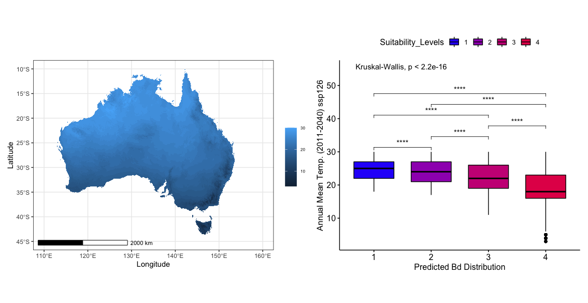

# Annual Mean Temperature (2011-2040) ssp126

### First Impressions

* The highest suitability level for *Batrachochytrium dendrobatidis* is found to occur towards the lower end of this environmental variable. This suggests that the higher annual average temperatures of the areas away from the coast is not suitable for *B. dendrobatidis*. The cooler annual temperatures at the coast promote better suitability.