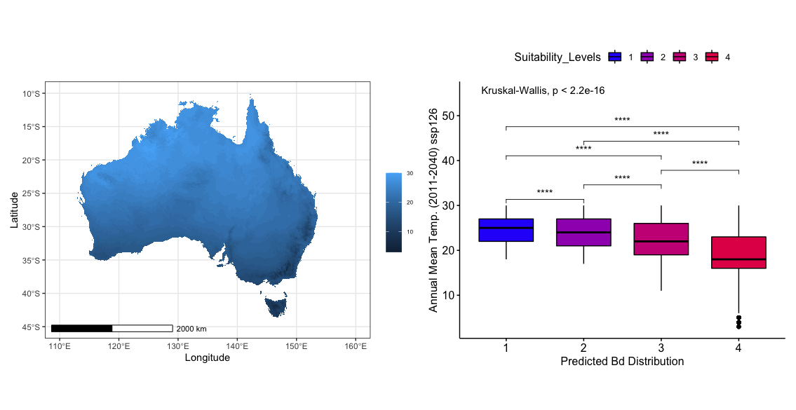

# Annual Mean Temperature (2011-2040) ssp126

### First Impressions

* The highest suitability level for *Batrachochytrium dendrobatidis* is found to occur towards the lower end of this environmental variable.

* Looking at the figure on the left, the mapped environmental data for Annual Mean Temperature between the 2011-2040 time frame under the ssp126 projection.

### What does this suggest?

* This suggests that the higher annual average temperatures of the areas away from the coast is not suitable for *B. dendrobatidis*. The cooler annual temperatures at the coast promote better suitability.

### What does the literature say?

* The relationship between *B. dendrobatidis* and temperature is an important one as it is also highly involved in the pathogen-host relationship. On one hand, amphibians invest more energy in immune system processes in warmer temperatures. On the other, *B. dendrobatidis'* abundance increases in cooler temperatures. The relationship between these two systems connected to temperature has not been fully explained.

* Furthermore, the recorded temperature range at which *B. dendrobatidis* expresses optimal growth is between (17-25) degrees celsius. Which also happens to reflect the suitability range of *B. dendrobatidis* when looking at the plot on the right.

### What do the level stats say?
According to the Kruskal-Wallis test, each suitability level is significantly different when plotted against Annual Mean Temperature in the 2011-2040 year range average at RCP 2.6 with $p < 2.2 * 10^{-10}$ 

