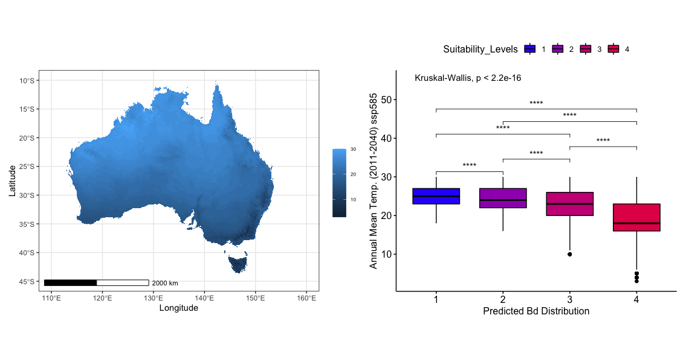

# Annual Mean Temperature (2011-2040) ssp585

### First Impressions

* Between these different projection scenarios, it seems that ssp585 ssp126 are similar in that
    the higher suitability locations are maintained at the lower end of the annual mean temperature data.
    However, ssp585 expresses a smaller range of temperature towards the lower end of suitability.

#### What does this suggest?

* This probably suggests that the Annual Mean Temperature range data in the 2011-2040 time frame
    itself has a higher general mean annual temperature; effectively decreasing the suitable range
    of *B. dendrobatidis* when compared to the RCP 2.6 projection.
