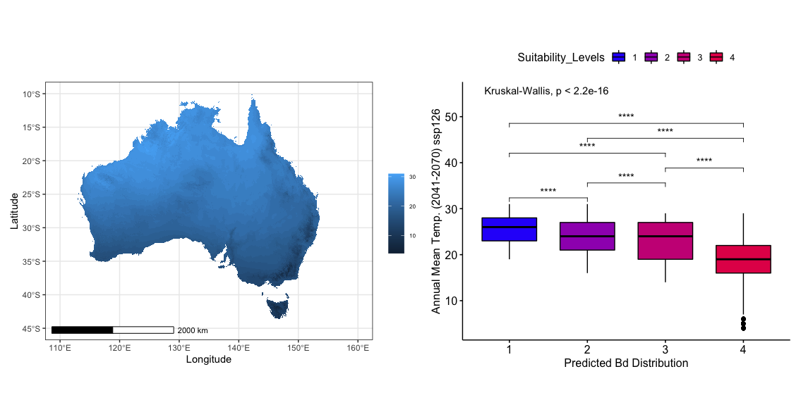

# Annual Mean Temperature (2041-2070) ssp126

### First Impressions

* Between this year projection and the ssp126 2011-2040 projection, they are similar in that the highest suitability is maintained towards the lower end of the annual mean temperature. This property has been maintained by each projection so far. However, the ssp126 2041-2070 scenario expresses a smaller range in temperature suitability amongst the highest level of projection.

#### What does this suggest?

* This might suggest a general temperature increase causing the overall average of the highest suitability level to fall while the rest increase.